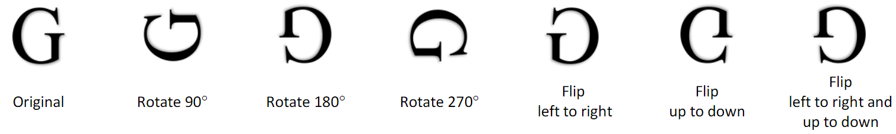
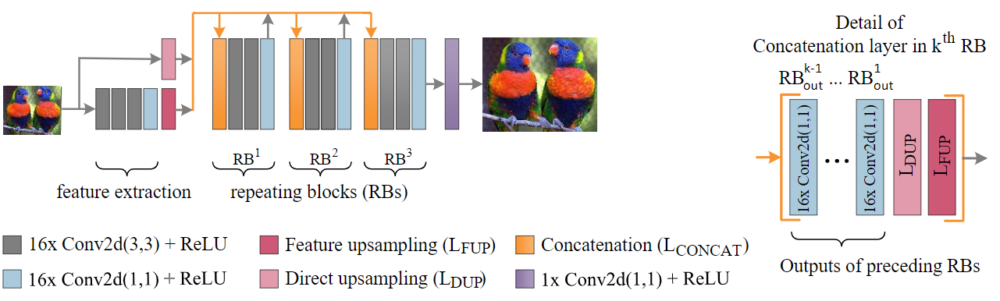
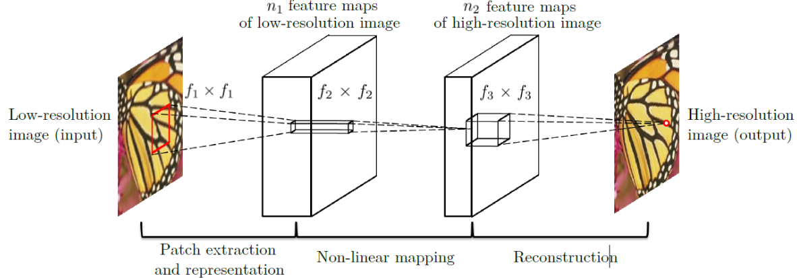
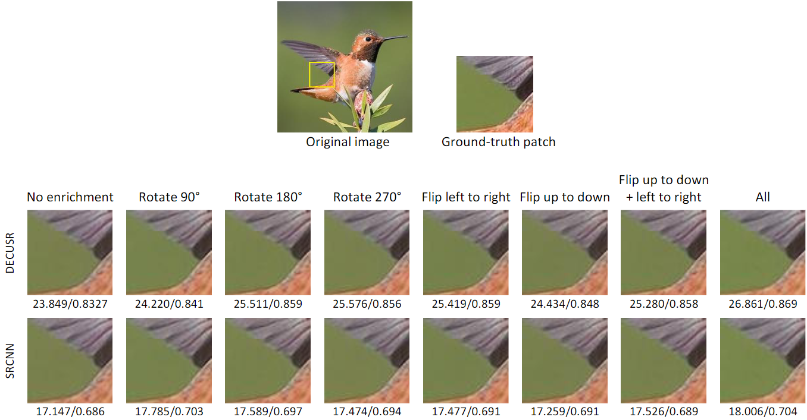

Repository for supporting files and outcomes for my paper entitled
[Effects of Data Enrichment with Image Transformations on the Performance of Deep Networks](https://journals.orclever.com/ejrnd/article/view/23/17) and published in
[The European Journal of Research and Development](https://journals.orclever.com/ejrnd/article/view/23/17).

Please cite the paper as follows:

*Temiz, H. (2022). Effects of Data Enrichment with 
Image Transformations on the Performance of Deep Networks.The European Journal of Research and Development,2(2), 23–33*
[https://doi.org/10.56038/ejrnd.v2i2.23](https://doi.org/10.56038/ejrnd.v2i2.23)

&nbsp;

## Overview

Images  cannot  always  be  expected  to  come  in  a  certain  standard  format  and  orientation.
Deep  networks need  to  be  trained  to  take  into  account  unexpected  variations  in  orientation  or  format.
The contribution of data augmentation with image transformations to the performance of deep networks in 
the super resolution problem were examined.


## Image Transormations

The following image transformations were examined in the study


&nbsp;


## Models
The following two modified deep learning models were used: [DECUSR](https://github.com/htemiz/DECUSR) and [SRCNN]() 


The visualizations and program codes of both algorithms are given in the subsequent two sections.

Given codes are of [DeepSR](https://github.com/htemiz/DeepSR) style definition. To run, e.g., DECUSR,

issue similar code below:

```python
--python.exe -m DeepSR.DeepSR --modelfile Decusr_3RB.py --train # --train argument to start training process
# --test for evaluate the performance of the model.
```

Please, refer to [DeepSR](https://github.com/htemiz/DeepSR) documentation for further information.


### DECUSR with 3 Repeating Blocks

The model revised to have 3 repeating blocks and ability to process 3-channel images.

Visualization of the model's architecture:



&nbsp;

Below is the DeepSR style code for the definition of DECUSR with 3 RB. 


```python
from keras import metrics
from keras import losses
from keras.models import Model
from keras.layers import Input, merge, ZeroPadding2D,  LocallyConnected2D, Conv2DTranspose, concatenate, BatchNormalization
from keras.layers.core import Dense, Dropout, Activation
from keras.layers.convolutional import Conv2D, UpSampling2D
from keras.layers.pooling import AveragePooling2D, GlobalAveragePooling2D, MaxPooling2D
from keras.layers.normalization import BatchNormalization
import keras.backend as K
from os.path import  dirname, abspath, basename
from keras.optimizers import Adam, SGD, RMSprop


eps = 1.1e-6

# PARAMETER INSTRUCTION WRT SCALE FACTOR #
"""

SCALE 2:
        stride=10, inputsize=16

SCALE 3:
        stride=8, inputsize=12

SCALE 4:
        stride=6, inputsize=8
"""

# parameters
settings = \
{
"activation": "relu",
'augment':[], # any combination of [90,180,270, 'flipud', 'fliplr', 'flipudlr' ]
'backend': 'tensorflow',
'batchsize':256,
'channels':3,
'colormode':'RGB', #
'crop': 0,
'crop_test': 6,
'decay':1e-6,
'dilation_rate':(1,1),
'decimation': 'bicubic',
'espatience' : 25,
'epoch':10,
'inputsize':16, #
'interp_compare': 'lanczos',
'interp_up': 'bicubic',
'kernel_initializer': 'he_normal',
'lrate':1e-4,
'lrpatience': 10,
'lrfactor' : 0.5,
'metrics': ["PSNR"],
'minimumlrate' : 1e-7,
'modelname':basename(__file__).split('.')[0],
'noise':'',
'normalization':['divide', '255.0'], # ['standard', "53.28741141", "40.73203139"],
'normalizeback': False,
'normalizeground':False,
'outputdir':'',
'scale':2,
'seed': 19,
'shuffle' : True,
'stride':10, #
'target_channels': 3,
'target_cmode' : 'RGB',
'testpath': [r'D:\calisma\projeler\augmentation\dataset\test'],# replace with path to your test files
'traindir': r"D:\calisma\projeler\augmentation\dataset\train", # replace with path to your training files
'upscaleimage': False,
'valdir': r'D:\calisma\projeler\augmentation\dataset\val', # replace with path to your validation files
'weightpath':'',
'workingdir': '',
}


def build_model(self, testmode=False):
    if testmode:
        input_size = None
    else:
        input_size = self.inputsize

    input_shape = (input_size, input_size, self.channels)

    main_input = Input(shape=input_shape, name='main_input')
    
    pre_block = Conv2D(16, (3, 3), activation=self.activation, kernel_initializer=self.kernel_initializer,  padding='same')(main_input)
    pre_block = Conv2D(16, (3, 3), activation=self.activation, kernel_initializer=self.kernel_initializer,  padding='same')(pre_block)
    pre_block = Conv2D(16, (3, 3), activation=self.activation, kernel_initializer=self.kernel_initializer,  padding='same')(pre_block)
    pre_block = Conv2D(16, (1, 1), activation=self.activation, kernel_initializer=self.kernel_initializer,  padding='same')(pre_block)

    upsampler_LC = UpSampling2D(self.scale, name='upsampler_locally_connected')(pre_block)
    upsampler_direct = UpSampling2D(self.scale)(main_input)

    # REPEATING BLOCKS #
    block1 = concatenate([upsampler_LC, upsampler_direct])
    block1 = Conv2D(16, (3, 3), activation=self.activation, kernel_initializer=self.kernel_initializer,  padding='same')(block1)
    block1 = Conv2D(16, (3, 3), activation=self.activation, kernel_initializer=self.kernel_initializer,  padding='same')(block1)
    block1 = Conv2D(16, (1, 1), activation=self.activation, kernel_initializer=self.kernel_initializer,  padding='same')(block1)

    block2 = concatenate([upsampler_LC, upsampler_direct, block1])
    block2 = Conv2D(16, (3, 3), activation=self.activation, kernel_initializer=self.kernel_initializer,  padding='same')(block2)
    block2 = Conv2D(16, (3, 3), activation=self.activation, kernel_initializer=self.kernel_initializer,  padding='same')(block2)
    block2 = Conv2D(16, (1, 1), activation=self.activation, kernel_initializer=self.kernel_initializer,  padding='same')(block2)

    block3 = concatenate([upsampler_LC, upsampler_direct, block1, block2])
    block3 = Conv2D(16, (3, 3), activation=self.activation, kernel_initializer=self.kernel_initializer,  padding='same')(block3)
    block3 = Conv2D(16, (3, 3), activation=self.activation, kernel_initializer=self.kernel_initializer,  padding='same')(block3)
    block3 = Conv2D(16, (1, 1), activation=self.activation, kernel_initializer=self.kernel_initializer,  padding='same')(block3)

    nihai = Conv2D(self.channels, (3, 3), activation=self.lactivation, kernel_initializer=self.kernel_initializer,  padding='same')(block3)

    model = Model(main_input, outputs=nihai)
    model.compile(Adam(self.lrate, self.decay), loss=losses.mean_squared_error)

    # model.summary()

    return model

```


&nbsp;


### SRCNN

SRCNN was also modified to have ability to process 3-channel images, as it was originally designed to process 1-channel
images.

The architecture of modified SRCNN:



&nbsp;

Below is the DeepSR style code for the definition of SRCNN.

```python

from keras import metrics
from keras import losses
from keras.layers import Input, Dense
from keras.callbacks import CSVLogger, EarlyStopping, ReduceLROnPlateau, ModelCheckpoint
from keras.layers.convolutional import Conv2D, UpSampling2D
from keras.models import Sequential, Model
from keras.optimizers import Adam
from os.path import  dirname, abspath, basename

eps = 1.1e-6

settings = \
{
'augment':[], # any combination of [90,180,270, 'flipud', 'fliplr', 'flipudlr' ]
'backend': 'tensorflow',
'batchsize':512,
'channels':3,
'colormode':'RGB', # 'YCbCr' or 'RGB'
'crop': 6,
'crop_test': 0,
'decay':1e-6,
'decimation': 'bicubic',
'dilation_rate':(1,1),
'espatience' : 25,
'epoch':50,
'inputsize':33, #
'interp_compare': '',
'interp_up': 'bicubic',
'kernel_initialer':'glorot_uniform',
'lrate':0.001,
'lrpatience': 25,
'lrfactor' : 0.5,
'metrics': 'PSNR',
'minimumlrate' : 1e-7,
'modelname':basename(__file__).split('.')[0],
'noise':'',
'normalization':['divide', 255.0], # ['standard', "53.28741141", "40.73203139"],
'normalizeback': False,
'normalizeground':False,
'outputdir':'',
'scale':2,
'seed': 19,
'shuffle' : False,
'stride':11, #
'target_channels': 3,
'target_cmode' : 'RGB',
'testpath': [r'D:\calisma\projeler\augmentation\dataset\test'], # replace with path to your test files
'traindir': r"D:\calisma\projeler\augmentation\dataset\train", # replace with path to your training files
'upscaleimage': True,
'valdir': r'D:\calisma\projeler\augmentation\dataset\val', # replace with path to your validation files
'weightpath':'',
'workingdir': '',
}


def build_model(self, testmode=False):

    if testmode:
        input_size = None
    else:
        input_size = self.inputsize
	
    input_shape = (input_size, input_size, self.channels)

    SRCNN_INPUT = Input(shape=input_shape)
    SRCNN = Conv2D(64,(9,9), kernel_initializer=self.kernel_initialer, dilation_rate=self.dilation_rate,
                   padding='valid', input_shape=input_shape)(SRCNN_INPUT)
    SRCNN = self.apply_activation(SRCNN, self.activation, self.activation + "_01")
    SRCNN = Conv2D(32, (1,1), kernel_initializer=self.kernel_initialer, dilation_rate=self.dilation_rate, padding='valid')(SRCNN)
    SRCNN = self.apply_activation(SRCNN, self.activation, self.activation + "_02")
    SRCNN = Conv2D(self.target_channels,(5,5), kernel_initializer=self.kernel_initialer, dilation_rate=self.dilation_rate, padding='valid')(SRCNN)
    SRCNN = self.apply_activation(SRCNN, self.lactivation, self.lactivation + "_03")

    SRCNN = Model(SRCNN_INPUT, outputs=SRCNN)

    SRCNN.compile(Adam(self.lrate, self.decay), loss=losses.mean_squared_error)

    # SRCNN.summary()
    return SRCNN
```

&nbsp;


## Visual Outputs
Visual outputs of data augmentation with each image transformations are given below. 
The values below the image patches belong to PSNR/SSIM. 



Data augmentation with all transformations ensure the best performance of the models.
Augmentation with 180 degrees rotation provides the highest performance among single 
transformations.


&nbsp;


Please feel free to contact me at [htemiz@artvin.edu.tr](mailto:htemiz@artvin.edu.tr) for any further information.